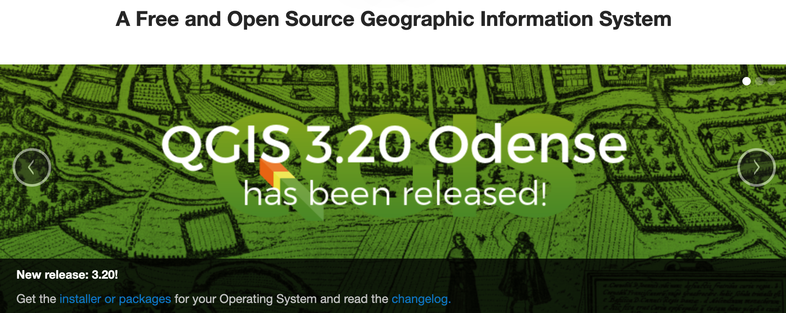
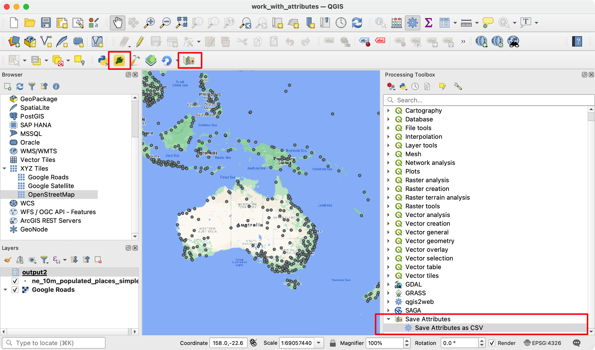
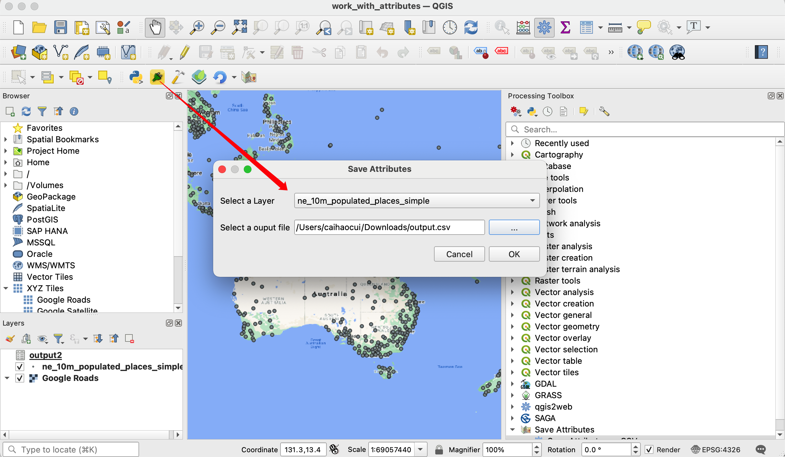
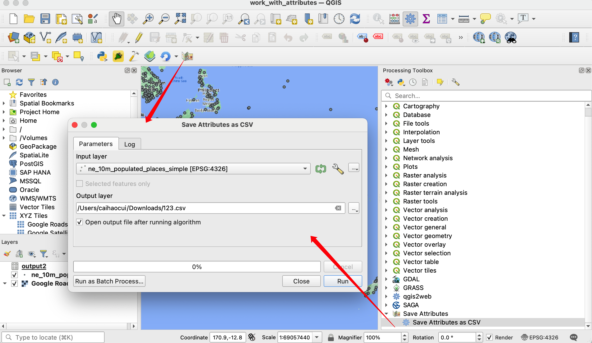

# QGIS(3) Plugin Development with Python Programming

[QGIS](https://www.qgis.org/en/site/#) has a powerful programming interface that allows you to extend the core functionality of the software as well as write scripts to automate your tasks.

QGIS supports the popular Python scripting language. Even if you are a beginner, learning a little bit of Python and QGIS programming interface will allow you to be much more productive in your work.

This repo assumes no prior programming knowledge and is intended to give an introduction to python scripting in QGIS (PyQGIS).

Requirments:
- QGIS(3.20.2-Odense) ( version >3.16.10 ).
- Qt Creator
- Python Bindings for Qt (pyqt5)
- A Text Editor or a Python IDE (sublime text, vscode, pycharm, etc.)
- QGIS plugins: 
    - Plugin Builder
    - Plugins Reloader 

Find the tutorial in the reference links or the [`html`](./html/) folder. 

## Building a Python Plugin (QGIS3) with Qt5 (Hard)
Plugins are a great way to extend the functionality of QGIS. You can write plugins using Python that can range from adding a simple button to sohpisticated toolkits. This tutorial will outline the process involved in setting up your development environment, designing the user interface for a plugin and writing code to interact with QGIS.

### Task Description

We will develop a simple plugin called `Save Attributes` that will allow users to pick a vector layer and write its attributes to a CSV file.

## Building a Processing Plugin (QGIS3) (Easy)
In the previous tutorial Building a Python Plugin (QGIS3), you learnt how to create a python plugin - including the user interface and custom logic for processing the data. While these type of plugins are useful, it puts the burden of designing the user interface on the plugin author. 

This results in each plugin having different ways to interact with it - which is confusing to the users. Also, regular plugins do not interact with another parts of QGIS. 

For example, you cannot use the plugin functionality from another algorithm. If the plugin that you want to write is primarily for analysis, and the user interaction that you want is limited to letting the user pick inputs and outputs, there is a much easier and preferred way to write plugins using the Processing Framework. 

It removes the need for you to design the user interface - simplifying the process. The built-in processing library creates a standard processing interface depending on your inputs that looks and behaves just like any other processing algorithm in QGIS. It also seamlessly integrates with rest of the Processing framework - so your plugin algorithms can be used in batch processing, graphical modeler, called from python console etc.

## Reference
- [Python Programming (QGIS3)](https://www.qgistutorials.com/en/docs/3/getting_started_with_pyqgis.html)
- [Building a Python Plugin (QGIS3)](https://www.qgistutorials.com/en/docs/3/building_a_python_plugin.html)
- [Building a Processing Plugin (QGIS3)](https://www.qgistutorials.com/en/docs/3/processing_python_plugin.html)